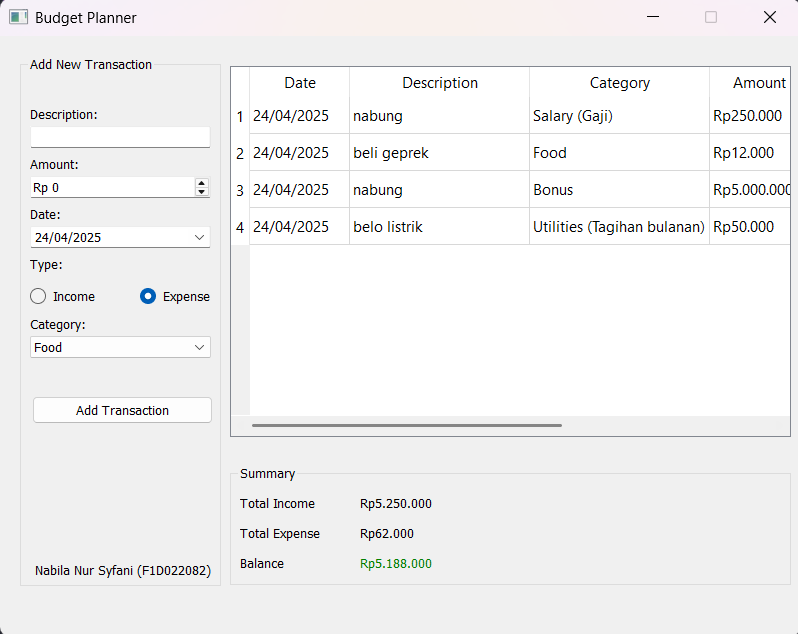

# pv25-miniproject-budgetplanner

<table align="center">
  <tr>
    <td align="center">
       
      <b>Menampilkan tampilan awal</b>
    </td>
    <td align="center">
       
      <b>Menampilkan jika description/amount belum diisi</b>
    </td>
  </tr>
  <tr>
    <td align="center">
       
      <b>Menampilkan bahwa income lebih besar daripada expense, sisa saldo ditampilkan dalam warna hijau sebagai tanda bahwa kondisi keuangan masih aman.</b>
    </td>
    <td align="center">
       
      <b>Menampilkan bahwa expense melebihi income sehingga saldo menjadi negatif dan ditampilkan dalam warna merah, menunjukkan bahwa keuangan mengalami defisit.</b>
    </td>
  </tr>
  <tr>
</table>
